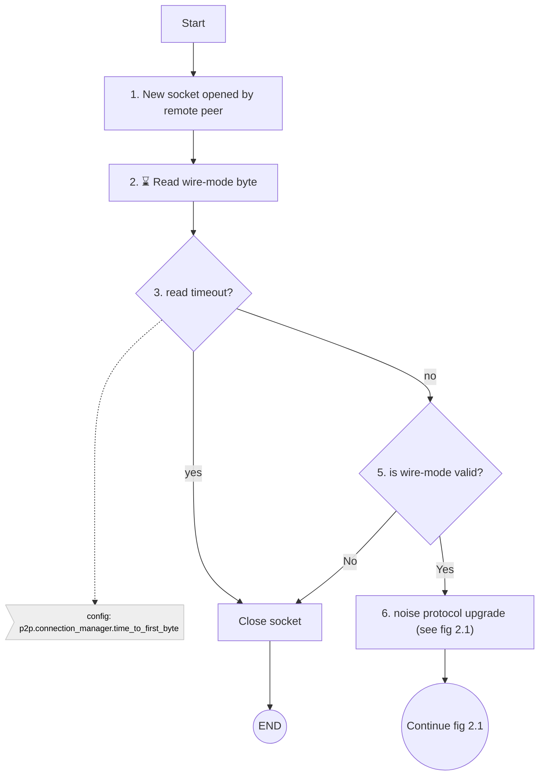
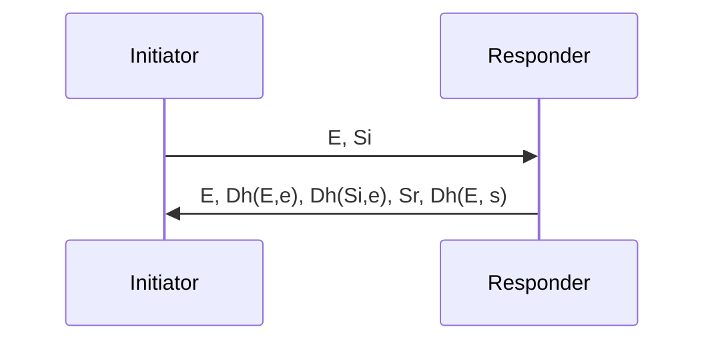
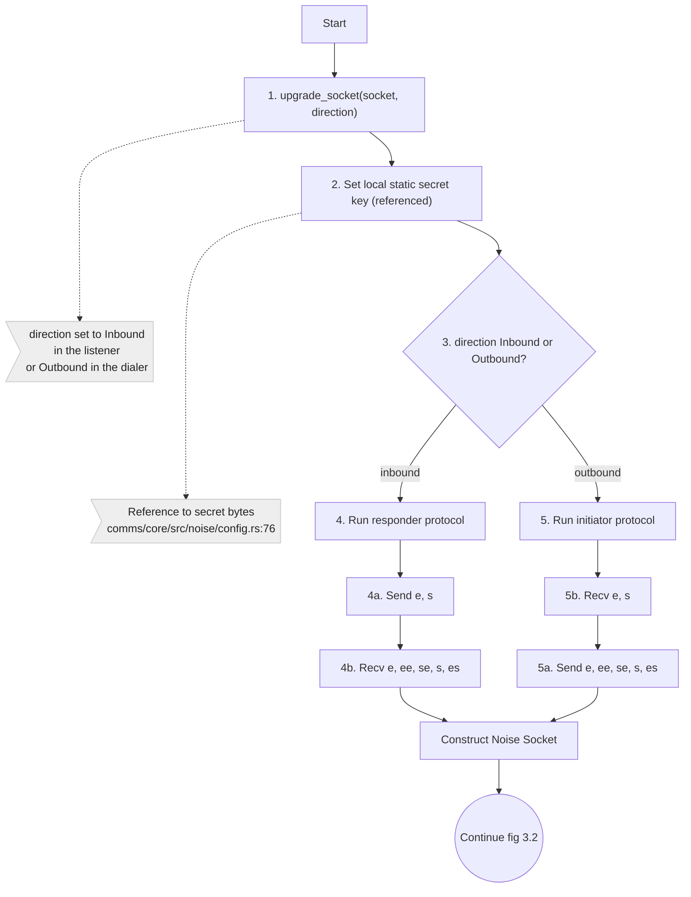
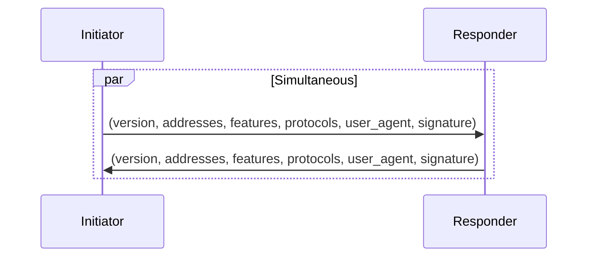
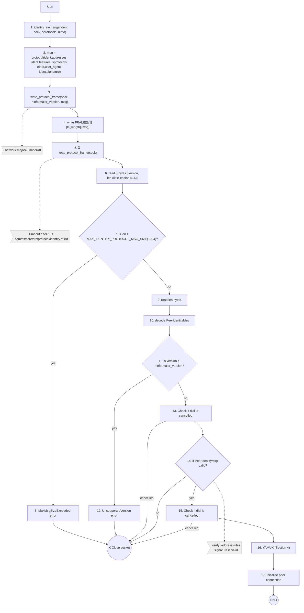

# Inbound Connection

## Overview

An inbound connection refers to an inbound connection on the configured transport of a comms node
initiated by a remote peer. Some examples are via an inbound TCP socket connection to the public address,
or an inbound connection from the tor SOCKS proxy. 

Once a socket is obtained, the connection is upgraded in the following order:
1. wire-mode
2. noise protocol
3. identity exchange
4. yamux

Once the upgrade process is complete, a PeerConnection is instantiated and passed to the connection manager component.

## 1. Wire-mode

### Overview

As soon as a socket is opened, the initiator of the connection sends a single byte to indicate which wire-mode it requires.
In the Tari protocol, comms is configured to only accept a wire-mode for the configured network (mainnet, testnet, etc).
If an invalid wire-mode is encountered the connection is immediately dropped. Since the connection has not been authenticated,
and indeed may not even be a Tari node (web browser, telnet, etc), we cannot ban any peer for sending invalid wire-mode.
Preventing unwanted inbound connections to the listener on the public internet is left to the node operator's firewall.

The network to wire-mode mapping can be found in [common/src/configuration/network.rs](https://github.com/tari-project/tari/blob/08ba91af3031aa2a3c5357a5f494f95f9c8a0049/common/src/configuration/network.rs#L39).
The wire-mode is sent in [comms/core/src/connection_manager/dialer.rs](https://github.com/tari-project/tari/blob/08ba91af3031aa2a3c5357a5f494f95f9c8a0049/comms/core/src/connection_manager/dialer.rs#L579)
and received in [comms/core/src/connection_manager/listener.rs](https://github.com/tari-project/tari/blob/08ba91af3031aa2a3c5357a5f494f95f9c8a0049/comms/core/src/connection_manager/listener.rs#L244C24-L244C24).

### Flow Diagram

<figcaption>Fig. 1.1 Wire-mode</figcaption>

## 2. Noise Protocol

### Overview

[Full specification](https://noiseprotocol.org/noise.html)

The noise protocol is used to authenticate the remote peer and establish a secure channel. The protocol is coded in
[comms/core/src/noise module](https://github.com/tari-project/tari/tree/08ba91af3031aa2a3c5357a5f494f95f9c8a0049/comms/core/src/noise).

The hard-coded noise protocol parameters are `Noise_IX_25519_ChaChaPoly_BLAKE2b`.
That is, the `Noise` protocol using: the `IX` handshake pattern, curve `25519` for Diffie-Hellman (specifically Ristretto 25519),
the `ChaChaPoly` cipher, and `BLAKE2b` for hashing.

The noise upgrade future must complete within the timeout.

`E` - ephemeral public key
`Si` - initiator's static public key
`Sr` - responder's static public key
`Dh(P,k)` - Diffie-Hellman function with public key `P` and private key `k`

<figcaption>Fig. 2.1 Single round-trip IX protocol</figcaption>

<figcaption>Fig. 2.2 Noise responder protocol</figcaption>

## 3. Identity Exchange

### Overview

Identity exchange occurs directly after the noise protocol upgrade and allows peers to exchange 
public addresses, PeerFeatures, supported protocols, user_agent and identity signature over an encrypted 
and authenticated connection.

Both the initiator (outbound) and responder (inbound) send their identity message immediately and continue on 
receipt of the peer's identity message, meaning that the protocol completes in a half-RTT. A maximum size of 
1024 bytes is permitted for messages.

The protocol is coded in comms/core/src/protocol/identity.rs

<figcaption>Fig. 3.1 Identity exchange protocol</figcaption>

<figcaption>Fig. 3.2 Identity exchange flow</figcaption>

## 4. Yamux upgrade

### Overview

Yamux is a multiplexing protocol that allows multiple substreams to be multiplexed over a single ordered 
transport connection (TCP, QUIC, etc.). Note: QUIC transport is not currently implemented.
Yamux supports backpressure which helps prevent the sender from overwhelming the receiver.

More about yamux [here](https://github.com/hashicorp/yamux/blob/master/spec.md) and [here](https://docs.libp2p.io/concepts/multiplex/yamux/).

After the identity exchange, the next frames that must occur after the identity exchange are the yamux protocol frames.
There is no over-the-wire upgrade process. 

